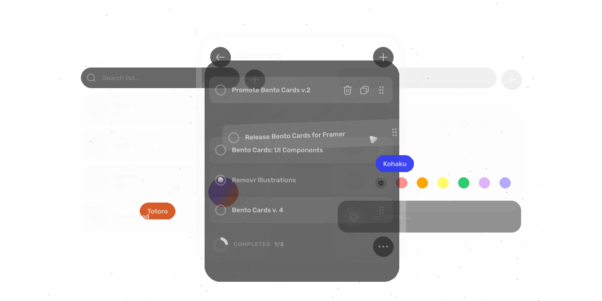

<h1 align="center">simpleList</h1>
<p align="center">Your tasks, simplified. Create, manage, and conquer your to-do lists with ease.</p>

<h3 align="center">
  <!-- Version Badge -->
  <a href="https://github.com/castrogusttavo/simpleList/releases">
    
  </a>  

  <!-- License Badge -->
  <a href="./LICENSE" target="_blank">
    
  </a>

  <!-- X Badge -->
  <a href="https://x.com/gustta_dev" target="_blank">
    
  </a>
</h3>

<br />

## Features
- 👨‍🚀 Create new lists and add items in seconds
- ⚙️ Drag, drop and rearrange your items effortlessly
- 💅 Dark Theme and custom themes
- 🚀 Cross-platform (Web, Windows)
- ✔️ Default shortcuts and lists
- 📦 Offline support (alpha)

<p align="center">
  
</p>

## Installation

> ⚠️ **For Web/Windows:** The app is in waitlist mode. Join the [waitlist](https://simplelist.vercel.app/waitlist) to be notified when it's ready.

## Usage & Settings

### 1. **Install SimpleList**
Create, manage, and conquer your to-do lists
with ease

### 2. **Create your first list**
Tap the '+' button and start adding items to
your list

### 3. **Stay organized effortlessly**
Manage, update, and complete tasks with ease

## Default Shortcuts

> ⚠️ **For Web/Windows:** The app is in waitlist mode. Join the [waitlist](https://simplelist.vercel.app/waitlist) to be notified when it's ready.

<table>
  <thead>
    <tr>
      <th>Command</th>
      <th>Action</th>
    </tr>
  </thead>
  <tbody>
    <tr>
      <td><kbd>Ctrl</kbd> + <kbd>K</kbd></td>
      <td>Focus Search Bar</td>
    </tr>
    <tr>
      <td><kbd>Enter</kbd></td>
      <td>Create new list or task</td>
    </tr>
    <tr>
      <td><kbd>Ctrl</kbd> + <kbd>↑</kbd> / <kbd>Ctrl</kbd> + <kbd>↓</kbd></td>
      <td>Move task</td>
    </tr>
    <tr>
      <td><kbd>Ctrl</kbd> + <kbd>H</kbd></td>
      <td>Hide completed tasks</td>
    </tr>
    <tr>
      <td><kbd>Ctrl</kbd> + <kbd>M</kbd></td>
      <td>Switch task view mode (detailed/minimal)</td>
    </tr>
    <tr>
      <td><kbd>Ctrl</kbd> + <kbd>Z</kbd></td>
      <td>Undo last action</td>
    </tr>
    <tr>
      <td><kbd>Ctrl</kbd> + <kbd>;</kbd></td>
      <td>Open settings</td>
    </tr>
  </tbody>
</table>

## Contributing

We welcome contributions! To get started:

1. Clone the repository.
2. Install dependencies:
   ```sh
   pnpm i
   ```
3. Run the development environment:
   ```sh
   pnpm dev
   ```

## Author

👤 **Gusttavo Castro**

- X: [@gustta_dev](https://twitter.com/gustta_dev)
- GitHub: [@castrogusttavo](https://github.com/castrogusttavo)
- LinkedIn: [@castrogusttavo](https://linkedin.com/in/castrogusttavo)

## Show Your Support

If this project helped you, give it a ⭐️!

--- 
<p align="center">
  <a href="https://simplelist.vercel.app/">
    
  </a>
</p>
<p align="center">
  <span>Join the waitlist for early access</span>
</p>